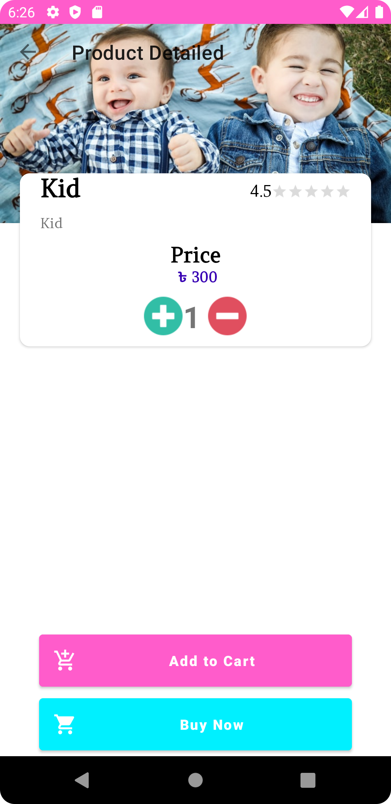
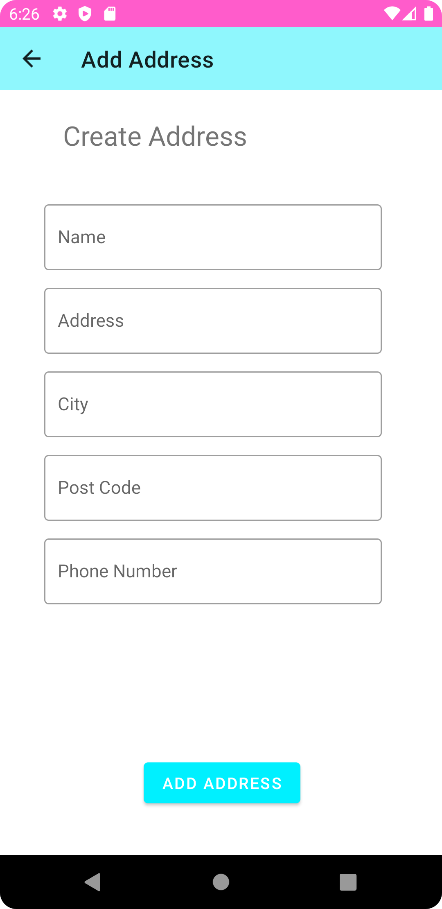
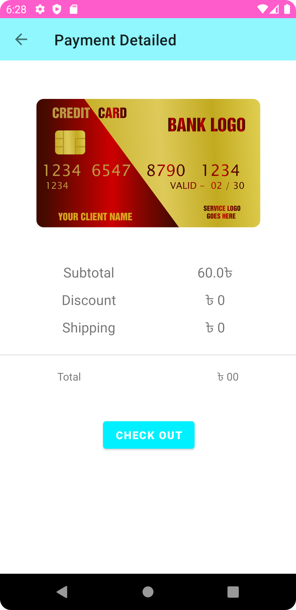

## General

eShopping App Using Android Studio & Firebase

<a id="raw-url" href="apk/eShopping.apk?raw=true">
</a>

## Screenshots

|                                       Sign In             |                            Sign Up                           |                            Home                           |
| :------------------------------------------------------------------: | :-----------------------------------------------------------------: | :------------------------------------------------------------------: |
|   |  |   |


|                                       Product                 |                            Address                           |                            Payment Gateway                           |
| :------------------------------------------------------------------: | :-----------------------------------------------------------------: | :------------------------------------------------------------------: |
|   |  |   |


## Dependencies

- Firebase Dependencies

```
implementation 'com.google.firebase:firebase-auth:21.0.1'
implementation 'com.google.firebase:firebase-database:20.0.2'
implementation 'com.google.firebase:firebase-firestore:23.0.3'
implementation 'com.google.firebase:firebase-storage:20.0.0'
```

- Others Dependencies

```
implementation 'com.github.denzcoskun:ImageSlideshow:0.1.0'
implementation 'com.github.bumptech.glide:glide:4.12.0'
annotationProcessor 'com.github.bumptech.glide:compiler:4.12.0'
implementation 'com.razorpay:checkout:1.6.12'
```
